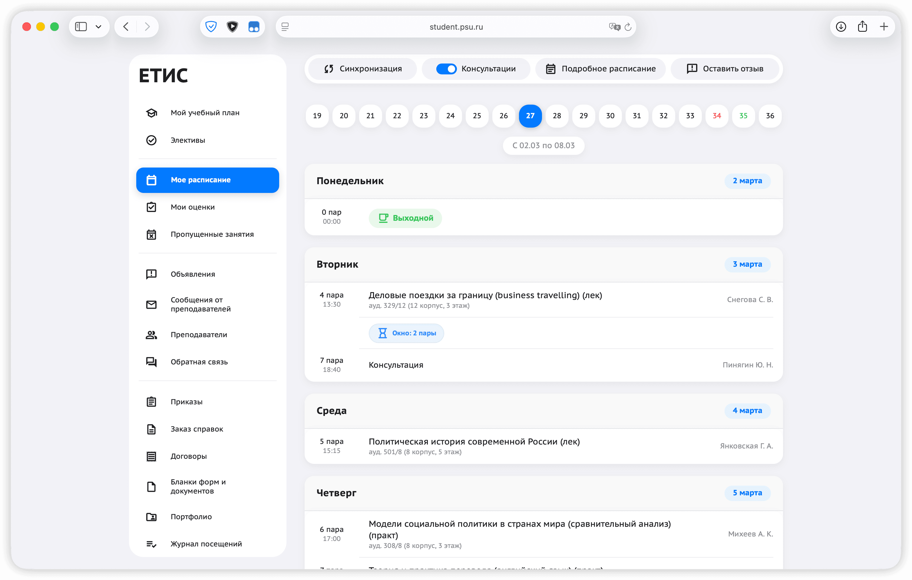
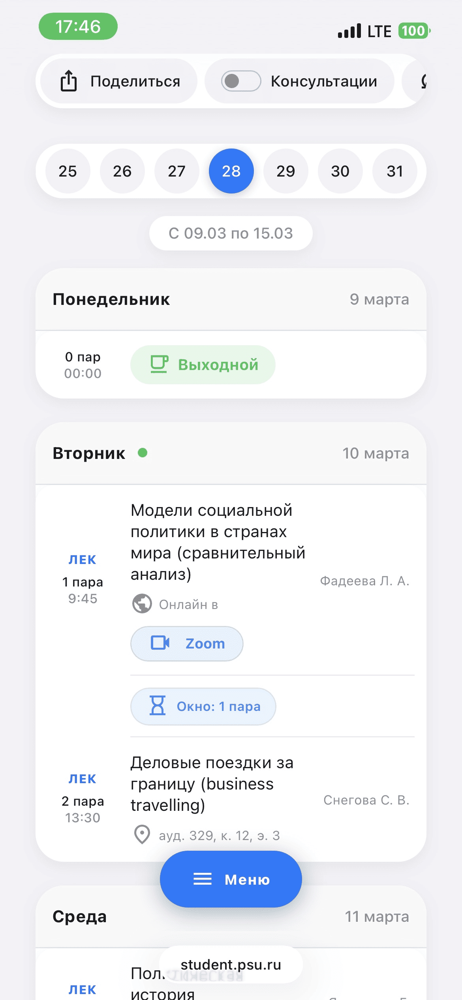
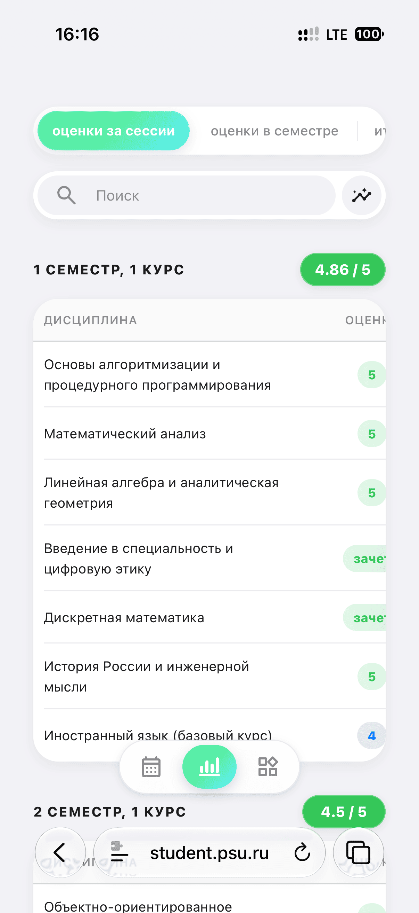
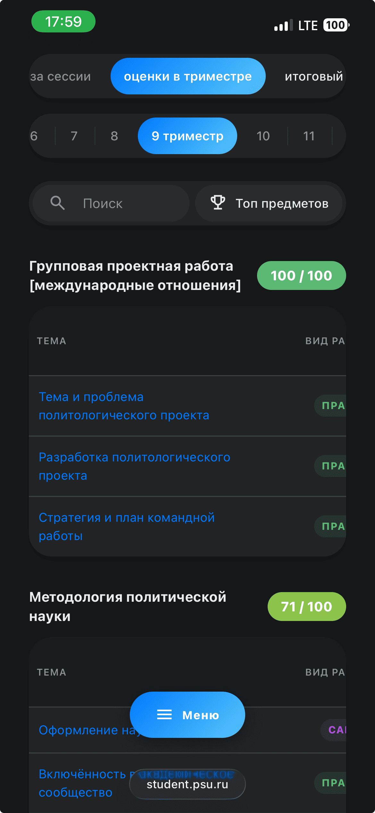
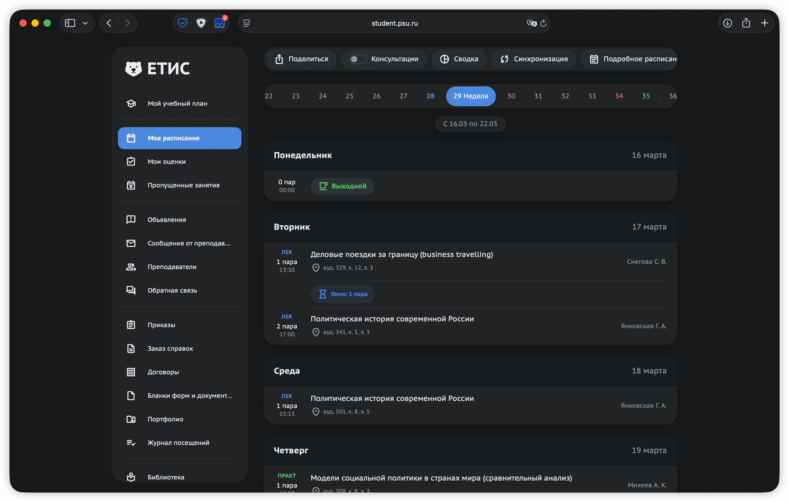
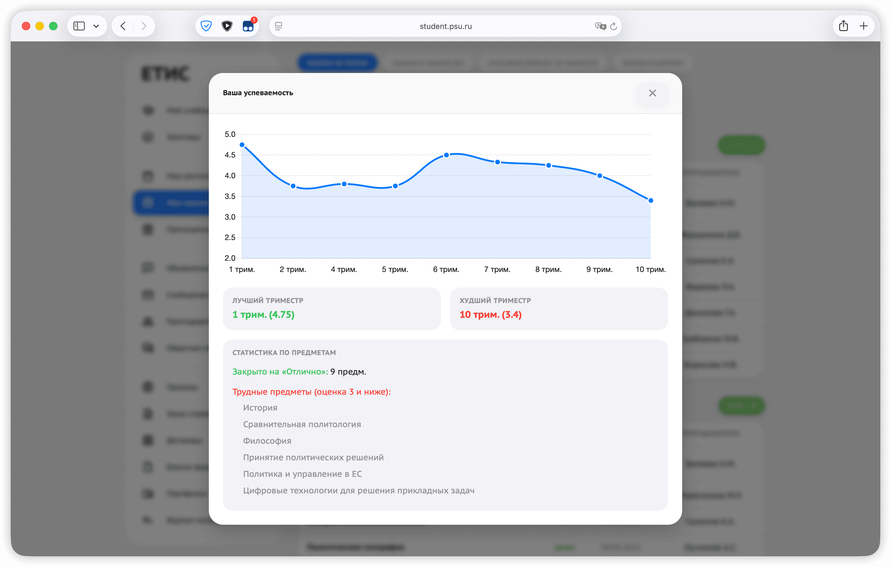
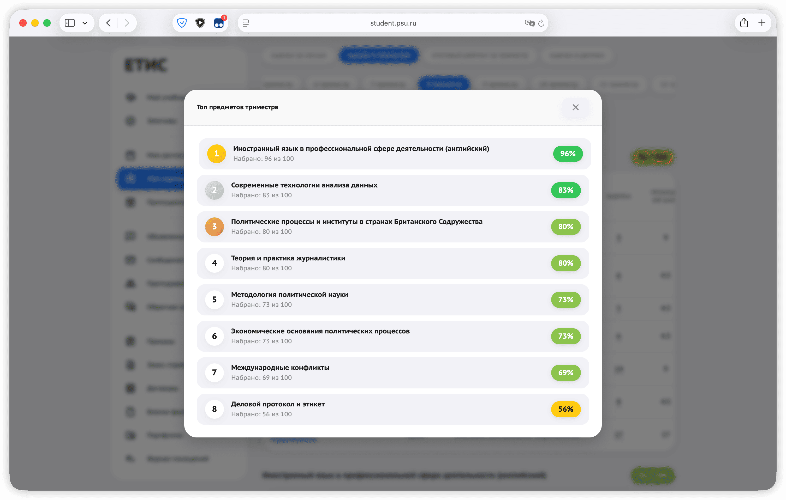

  

  # ЕТИС REBORN
  **Сделай ЕТИС великим снова**

  
  
  

  *Бесплатное браузерное расширение (userscript), которое полностью обновляет личный кабинет студента ПГНИУ. Современный дизайн, адаптация для смартфонов, тёмная тема и умная аналитика.*

  [**🌐 Официальный сайт с установкой**](https://etisreborn.ru/) •[**🐛 Сообщить об ошибке**](https://etisreborn.ru/#bugreport)

   
  

---

## ✨ Главные возможности

### 📱 Полноценная мобильная версия
Оригинальный ЕТИС невозможно использовать с телефона без лупы. **REBORN** перестраивает интерфейс: появляется удобное боковое меню, таблицы получают горизонтальную прокрутку, а расписание идеально адаптируется под узкие экраны.

  
  

### 🌙 Тёмная тема
Автоматически подстраивается под систему вашего устройства или переключается вручную. Бережет зрение при ночной подготовке к сессии и экономит заряд батареи на смартфонах с OLED-экранами.

  
  

### 📅 Умное расписание
*   **Светофор:** Зеленая/желтая/красная точка покажет, идет ли сейчас пара, скоро начнется или уже заканчивается.
*   **Окна и выходные:** Скрипт сам считает «окна» между парами и красиво оформляет дни без занятий.
*   **Заметки и ДЗ:** Прямо в расписании можно кликнуть на предмет и записать домашнее задание.
*   **Поделиться:** Экспорт расписания (или отдельного объявления) красивой картинкой в один клик.

### 📊 Продвинутая аналитика и оценки
Вместо сухих таблиц — наглядная статистика.
*   **Умные капсулы:** Визуальное отображение баллов.
*   **Калькулятор баллов:** Наведите на оценку в триместре, чтобы узнать, сколько баллов не хватает до 3, 4 или 5.
*   **Графики сессий:** Автоматический расчет среднего балла и построение красивых графиков успеваемости.

  
  

### 🛠 Множество улучшений (QoL)
*   **Справки:** Понятный статус готовности («ГОТОВО», «ОБРАБОТКА», «ЗАЯВКА»).
*   **Преподаватели:** Мгновенный поиск по списку преподавателей.
*   **Библиотека:** Копирование логинов/паролей от электронных ресурсов в один клик.
*   **Уведомления:** Скрипт запоминает ваши оценки и показывает всплывающее уведомление, если преподаватель поставил новые баллы.

---

## ⚙️ Установка

Так как это *Userscript*, для его работы нужен специальный менеджер скриптов в вашем браузере. Это безопасно и полностью бесплатно.

### 💻 Для ПК (Chrome, Яндекс, Edge, Firefox)
1. Установите расширение **[Tampermonkey](https://chromewebstore.google.com/detail/tampermonkey/dhdgffkkebhmkfjojejmpbldmpobfkfo)** или **[Violentmonkey](https://violentmonkey.github.io/)**.
2. Нажмите на **[ЭТУ ССЫЛКУ](https://raw.githubusercontent.com/defl-orator/etis-reborn/main/etis.user.js)**.
3. В открывшемся окне подтвердите установку (кнопка *Установить* / *Install*).
4. Зайдите на [student.psu.ru](https://student.psu.ru) — новый дизайн применится автоматически!

### 🍎 Для Apple (Safari на iPhone, iPad, Mac)
1. Скачайте приложение **[Stay for Safari](https://apps.apple.com/ru/app/stay-for-safari/id1591620171)** из App Store.
2. Включите расширение *Stay* в настройках Safari.
3. Нажмите на **[ЭТУ ССЫЛКУ](https://raw.githubusercontent.com/defl-orator/etis-reborn/main/etis.user.js)**.
4. В появившемся окне нажмите **«Install»** в правом нижнем углу.

*(⚠️ Обычный мобильный Google Chrome на Android и iOS не поддерживает расширения. На iOS используйте Safari, а на Android — браузеры с поддержкой расширений, например, Firefox или Яндекс.Браузер).*

---

## 🔒 Безопасность и Приватность

**Ваши данные остаются только вашими.** 
Расширение работает **исключительно локально** в вашем браузере. Оно лишь меняет визуальное отображение (CSS) и структуру страницы (HTML) «на лету», когда вы находитесь на сайте ЕТИС.
Никакие пароли, оценки или персональные данные не отправляются на сторонние серверы. 

---

## 🤝 Обратная связь

Если вы нашли баг, что-то поехало или есть крутая идея:
*   Оставьте репорт через форму на сайте: **[Сообщить об ошибке](https://etisreborn.ru/#bugreport)**
*   Или создайте **[Issue](https://github.com/defl-orator/etis-reborn/issues)** прямо здесь, на GitHub.
*   Оставить отзыв о расширении можно [тут](https://etisreborn.ru/#writereview).

---

  <i>Основано на идеях проекта <a href="https://vk.com/etis20">ETIS 2.0</a>. Создано с 💙 для студентов ПГНИУ.</i>

